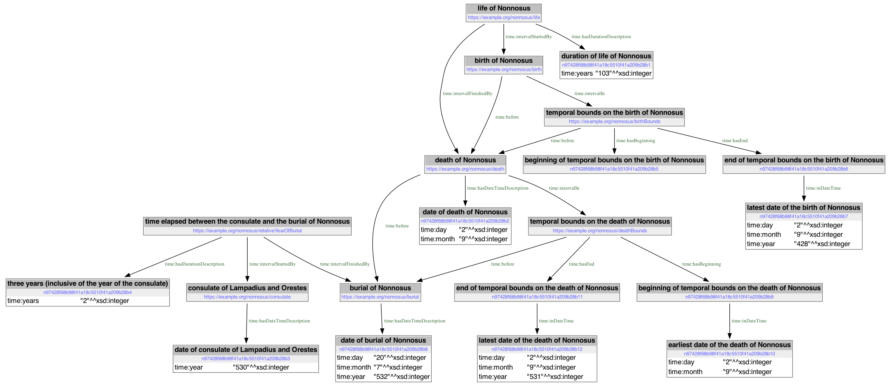

# Reasoning about relative times of events in the life of Nonnosus

In the altar of the parish church in Molzbichl there is a tombstone with the only inscription in Austria from the 6th century. The Latin inscription [reads](https://de.wikipedia.org/wiki/Nonnosus)

> Here rests the servant of Christ, the deacon Nonnosus, who lived about 103 years. He died on September 2nd and was buried on July 20th at this place in the eleventh year of the indiction three years after the consulship of the most famous men Lampadius and Orestes.

The assertions made in this inscription can be modeled using the [OWL-Time ontology](https://www.w3.org/TR/owl-time/):


See [this model in Turtle syntax](nonnosus.ttl).

From this model we can infer temporal boundaries on the possible dates of the birth and death of Nonnosus. To do this we need some inference rules. The rules used here are written in [Notation3](https://n3.restdesc.org/n3/), a superset of Turtle that also allows inference rules to be expressed.

The rule for inferring the year of the burial of Nonnosus, given the year of [the consulate of Lampadius and Orestes](https://www.trismegistos.org/period/2278), is:

```ttl
# If an interval has a known duration in years, and the year of start
# of the interval is known, then the year of the finish of interval
# can be inferred.
{
    ?i
      time:intervalStartedBy ?s ;
      time:intervalFinishedBy ?f ;
      time:hasDurationDescription [
        time:years ?years
      ] .

    ?s time:hasDateTimeDescription  [
      time:year ?s_y
    ] .

    ?f time:hasDateTimeDescription ?f_d .

    ( ?s_y ?years ) math:sum ?f_y .

} => {
    ?f_d time:year ?f_y .
} .
```

The rules for inferring a maximum temporal bound on the year of death of Nonnosus, given the year of the burial of Nonnosus, are:

```ttl
# If a dated interval is inside (bounded by) another interval (the
# bounding interval), and the dated interval must have occurred before
# another interval, the bounding interval also must have occurred
# before that other interval.
{
    ?i1
      time:before ?i2 ;
      time:intervalIn ?i1_bounds .

} => {
    ?i1_bounds time:before ?i2 .
} .

# If a dated interval occurred before another dated interval, and the
# month of the earlier interval is greater than the month of the later
# interval, then year of the earlier interval is at most one less than
# the year of the later interval.
{
    ?i1 time:before ?i2 .

    ?i1 time:hasEnd [
      time:inDateTime ?i1_e_d
    ] .

    ?i1_e_d time:month ?i1_e_month .

    ?i2 time:hasDateTimeDescription [
      time:month ?i2_month ;
      time:year ?i2_year
    ] .

    ?i1_e_month math:greaterThan ?i2_month .

    ( ?i2_year 1 ) math:difference ?i1_e_year .

} => {
    ?i1_e_d time:year ?i1_e_year .
} .
```

The rule for inferring a maximum temporal bound on the date of the birth of Nonnosus, given the duration of his life and the date of his death, is:

```ttl
# If an interval has a known duration in years, and the maximum
# temporal bound on the finish of the interval is dated, the a date for
# the maximum temporal bound of the start of the interval can be
# inferred.
{
    ?i
      time:intervalStartedBy ?s ;
      time:intervalFinishedBy ?f ;
      time:hasDurationDescription [
        time:years ?years
      ] .

    ?s time:intervalIn ?s_bounds .
    ?f time:intervalIn ?f_bounds .

    ?f_bounds time:hasEnd ?f_e .
    ?s_bounds time:hasEnd ?s_e .

    ?f_e time:inDateTime  [
      time:day ?f_e_d ;
      time:month ?f_e_m ;
      time:year ?f_e_y
    ] .

    ( ?f_e_y ?years ) math:difference ?s_e_y .

} => {
    ?s_e time:inDateTime [
      time:day ?f_e_d ;
      time:month ?f_e_m ;
      time:year ?s_e_y
    ] .
} .
```

See [the full set of inference rules](rules.n3).

After running the model and the inference rules through [the EYE reasoner](https://josd.github.io/eye/), we get the following results:



See [the inferred model in Turtle syntax](inferred.ttl).

You can [try running the reasoner yourself](http://ppr.cs.dal.ca:3002/n3/editor/?formula=%40base+%3Chttps%3A%2F%2Fexample.org%2Fnonnosus%2F%3E+.%0A%40prefix+%3A+%3C%3E+.%0A%40prefix+edtfo%3A+%3Cedtfo.ttl%23%3E+.%0A%40prefix+math%3A+%3Chttp%3A%2F%2Fwww.w3.org%2F2000%2F10%2Fswap%2Fmath%23%3E+.%0A%40prefix+owl%3A+%3Chttp%3A%2F%2Fwww.w3.org%2F2002%2F07%2Fowl%23%3E+.%0A%40prefix+rdfs%3A+%3Chttp%3A%2F%2Fwww.w3.org%2F2000%2F01%2Frdf-schema%23%3E+.%0A%40prefix+string%3A+%3Chttp%3A%2F%2Fwww.w3.org%2F2000%2F10%2Fswap%2Fstring%23%3E+.%0A%40prefix+time%3A+%3Chttp%3A%2F%2Fwww.w3.org%2F2006%2Ftime%23%3E+.%0A%0A%3Abirth%0A++rdfs%3Alabel+%22birth+of+Nonnosus%22+%3B%0A++time%3Abefore+%3Adeath+%3B%0A++time%3AintervalIn+%3AbirthBounds+.%0A%0A%3AbirthBounds%0A++rdfs%3Alabel+%22temporal+bounds+on+the+birth+of+Nonnosus%22+.%0A%0A%3Adeath%0A++rdfs%3Alabel+%22death+of+Nonnosus%22+%3B%0A++time%3Abefore+%3Aburial+%3B%0A++time%3AhasDateTimeDescription+%5B%0A++++rdfs%3Alabel+%22date+of+death+of+Nonnosus%22+%3B%0A++++time%3Aday+2+%3B%0A++++time%3Amonth+9%0A++%5D+%3B%0A++time%3AintervalIn+%3AdeathBounds+.%0A%0A%3AdeathBounds%0A++rdfs%3Alabel+%22temporal+bounds+on+the+death+of+Nonnosus%22+.%0A%0A%3Aburial%0A++rdfs%3Alabel+%22burial+of+Nonnosus%22+%3B%0A++time%3AhasDateTimeDescription+%5B%0A++++rdfs%3Alabel+%22date+of+burial+of+Nonnosus%22+%3B%0A++++time%3Aday+20+%3B%0A++++time%3Amonth+7%0A++%5D+.%0A%0A%3Alife%0A++rdfs%3Alabel+%22life+of+Nonnosus%22+%3B%0A++time%3AintervalStartedBy+%3Abirth+%3B%0A++time%3AintervalFinishedBy+%3Adeath+%3B%0A++time%3AhasDurationDescription+%5B%0A++++rdfs%3Alabel+%22duration+of+life+of+Nonnosus%22+%3B%0A++++time%3Ayears+103%0A++%5D+.%0A%0A%3Aconsulate%0A++rdfs%3Alabel+%22consulate+of+Lampadius+and+Orestes%22+%3B%0A++time%3AhasDateTimeDescription+%5B%0A++++rdfs%3Alabel+%22date+of+consulate+of+Lampadius+and+Orestes%22+%3B%0A++++time%3Ayear+530%0A++%5D+.%0A%0A%3ArelativeYearOfBurial%0A++rdfs%3Alabel+%22time+elapsed+between+the+consulate+and+the+burial+of+Nonnosus%22+%3B%0A++time%3AintervalStartedBy+%3Aconsulate+%3B%0A++time%3AintervalFinishedBy+%3Aburial+%3B%0A++time%3AhasDurationDescription+%5B%0A++++rdfs%3Alabel+%22three+years+(inclusive+of+the+year+of+the+consulate)%22+%3B%0A++++time%3Ayears+2%0A++%5D+.%0A%0A%23+Rules+--------------------------------------------------------------%0A%0A%23+If+an+interval+is+inside+(bounded+by)+another+interval+(the+bounding%0A%23+interval)%2C+then+the+bounding+interval+has+a+beginning+and+an+end.%0A%7B%0A++++%3Fi+time%3AintervalIn+%3Fbounds+.%0A%0A%7D+%3D%3E+%7B%0A++++%3Fbounds+time%3AhasBeginning+%5B%5D+.%0A++++%3Fbounds+time%3AhasEnd+%5B%5D+.%0A%7D+.%0A%0A%23+If+a+dated+interval+is+inside+(bounded+by)+another+interval+(the%0A%23+bounding+interval)%2C+the+beginning+and+the+end+of+the+bounding%0A%23+interval+can+also+be+dated.%0A%7B%0A++++%3Fi%0A++++++time%3AhasDateTimeDescription+%3Fi_d+%3B%0A++++++time%3AintervalIn+%5B%0A++++++++time%3AhasBeginning+%3Fbounds_b+%3B%0A++++++++time%3AhasEnd+%3Fbounds_e%0A++++++%5D+.%0A%0A%7D+%3D%3E+%7B%0A++++%3Fbounds_b+time%3AinDateTime+%5B%5D+.%0A++++%3Fbounds_e+time%3AinDateTime+%5B%5D+.%0A%7D+.%0A%0A%23+If+a+dated+interval+is+inside+(bounded+by)+another+interval+(the%0A%23+bounding+interval)%2C+the+dates+of+the+beginning+and+the+end+of+the%0A%23+bounding+interval+have+the+same+day+as+the+dated+interval.%0A%7B%0A++++%3Fi%0A++++++time%3AintervalIn+%3Fbounds+%3B%0A++++++time%3AhasDateTimeDescription+%5B+time%3Aday+%3Fd+%5D+.%0A%0A++++%3Fbounds%0A++++++time%3AhasBeginning+%5B+time%3AinDateTime+%3Fc_b_d+%5D+%3B%0A++++++time%3AhasEnd+%5B+time%3AinDateTime+%3Fc_e_d+%5D+.%0A%0A%7D+%3D%3E+%7B%0A++++%3Fc_b_d+time%3Aday+%3Fd+.%0A++++%3Fc_e_d+time%3Aday+%3Fd+.%0A%7D+.%0A%0A%23+If+a+dated+interval+is+inside+(bounded+by)+another+interval+(the%0A%23+bounding+interval)%2C+the+dates+of+the+beginning+and+the+end+of+the%0A%23+bounding+interval+have+the+same+month+as+the+dated+interval.%0A%7B%0A++++%3Fi%0A++++++time%3AintervalIn+%3Fbounds+%3B%0A++++++time%3AhasDateTimeDescription+%5B+time%3Amonth+%3Fm+%5D+.%0A%0A++++%3Fbounds%0A++++++time%3AhasBeginning+%5B+time%3AinDateTime+%3Fc_b_d+%5D+%3B%0A++++++time%3AhasEnd+%5B+time%3AinDateTime+%3Fc_e_d+%5D+.%0A%0A%7D+%3D%3E+%7B%0A++++%3Fc_b_d+time%3Amonth+%3Fm+.%0A++++%3Fc_e_d+time%3Amonth+%3Fm+.%0A%7D+.%0A%0A%23+If+a+dated+interval+is+inside+(bounded+by)+another+interval+(the%0A%23+bounding+interval)%2C+and+the+dated+interval+must+have+occurred+before%0A%23+another+interval%2C+the+bounding+interval+also+must+have+occurred%0A%23+before+that+other+interval.%0A%7B%0A++++%3Fi1%0A++++++time%3Abefore+%3Fi2+%3B%0A++++++time%3AintervalIn+%3Fi1_bounds+.%0A%0A%7D+%3D%3E+%7B%0A++++%3Fi1_bounds+time%3Abefore+%3Fi2+.%0A%7D+.%0A%0A%23+If+a+dated+interval+occurred+before+another+dated+interval%2C+and+the%0A%23+month+of+the+earlier+interval+is+greater+than+the+month+of+the+later%0A%23+interval%2C+then+year+of+the+earlier+interval+is+at+most+one+less+than%0A%23+the+year+of+the+later+interval.%0A%7B%0A++++%3Fi1+time%3Abefore+%3Fi2+.%0A%0A++++%3Fi1+time%3AhasEnd+%5B%0A++++++time%3AinDateTime+%3Fi1_e_d%0A++++%5D+.%0A%0A++++%3Fi1_e_d+time%3Amonth+%3Fi1_e_month+.%0A%0A++++%3Fi2+time%3AhasDateTimeDescription+%5B%0A++++++time%3Amonth+%3Fi2_month+%3B%0A++++++time%3Ayear+%3Fi2_year%0A++++%5D+.%0A%0A++++%3Fi1_e_month+math%3AgreaterThan+%3Fi2_month+.%0A%0A++++(+%3Fi2_year+1+)+math%3Adifference+%3Fi1_e_year+.%0A%0A%7D+%3D%3E+%7B%0A++++%3Fi1_e_d+time%3Ayear+%3Fi1_e_year+.%0A%7D+.%0A%0A%23+If+a+dated+interval+occurred+before+another+dated+interval%2C+and+the%0A%23+month+of+the+earlier+interval+is+less+than+the+month+of+the+later%0A%23+interval%2C+then+year+of+the+earlier+interval+is+at+most+the+same+as%0A%23+the+year+of+the+later+interval.%0A%7B%0A++++%3Fi1+time%3Abefore+%3Fi2+.%0A%0A++++%3Fi1+time%3AhasEnd+%5B%0A++++++time%3AinDateTime+%3Fi1_e_d%0A++++%5D+.%0A%0A++++%3Fi1_e_d+time%3Amonth+%3Fi1_e_month+.%0A%0A++++%3Fi2+time%3AhasDateTimeDescription+%5B%0A++++++time%3Amonth+%3Fi2_month+%3B%0A++++++time%3Ayear+%3Fi2_year%0A++++%5D+.%0A%0A++++%3Fi1_e_month+math%3AlessThan+%3Fi2_month+.%0A%0A%7D+%3D%3E+%7B%0A++++%3Fi1_e_d+time%3Ayear+%3Fi2_year+.%0A%7D+.%0A%0A%23+If+a+dated+interval+occurred+before+another+dated+interval%2C+and+the%0A%23+month+of+the+earlier+interval+is+the+same+as+the+month+of+the+later%0A%23+interval%2C+and+the+day+of+the+earlier+interval+is+greater+than+the%0A%23+day+of+the+later+interval%2C+then+year+of+the+earlier+interval+is+at%0A%23+most+one+less+than+the+year+of+the+later+interval.%0A%7B%0A++++%3Fi1+time%3Abefore+%3Fi2+.%0A%0A++++%3Fi1+time%3AhasEnd+%5B%0A++++++time%3AinDateTime+%3Fi1_e_d%0A++++%5D+.%0A%0A++++%3Fi1_e_d%0A++++++time%3Aday+%3Fi1_e_day+%3B%0A++++++time%3Amonth+%3Fi1_e_month+.%0A%0A++++%3Fi2+time%3AhasDateTimeDescription+%5B%0A++++++time%3Aday+%3Fi2_day+%3B%0A++++++time%3Amonth+%3Fi2_month+%3B%0A++++++time%3Ayear+%3Fi2_year%0A++++%5D+.%0A%0A++++%3Fi1_e_month+math%3AequalTo+%3Fi2_month+.%0A++++%3Fi1_e_day+math%3AgreaterThan+%3Fi2_day+.%0A%0A++++(+%3Fi2_year+1+)+math%3Adifference+%3Fi1_e_year+.%0A%0A%7D+%3D%3E+%7B%0A++++%3Fi1_e_d+time%3Ayear+%3Fi1_e_year+.%0A%7D+.%0A%0A%23+If+a+dated+interval+occurred+before+another+dated+interval%2C+and+the%0A%23+month+of+the+earlier+interval+is+the+same+as+the+month+of+the+later%0A%23+interval%2C+and+the+day+of+the+earlier+interval+is+not+greater+than%0A%23+the+day+of+the+later+interval%2C+then+year+of+the+earlier+interval+is%0A%23+at+most+the+same+as+the+year+of+the+later+interval.%0A%7B%0A++++%3Fi1+time%3Abefore+%3Fi2+.%0A%0A++++%3Fi1+time%3AhasEnd+%5B%0A++++++time%3AinDateTime+%3Fi1_e_d%0A++++%5D+.%0A%0A++++%3Fi1_e_d%0A++++++time%3Aday+%3Fi1_e_day+%3B%0A++++++time%3Amonth+%3Fi1_e_month+.%0A%0A++++%3Fi2+time%3AhasDateTimeDescription+%5B%0A++++++time%3Aday+%3Fi2_day+%3B%0A++++++time%3Amonth+%3Fi2_month+%3B%0A++++++time%3Ayear+%3Fi2_year%0A++++%5D+.%0A%0A++++%3Fi1_e_month+math%3AequalTo+%3Fi2_month+.%0A++++%3Fi1_e_day+math%3AnotGreaterThan+%3Fi2_day+.%0A%0A%7D+%3D%3E+%7B%0A++++%3Fi1_e_d+time%3Ayear+%3Fi2_year+.%0A%7D+.%0A%0A%23+If+an+interval+has+a+known+duration+in+years%2C+and+the+maximum%0A%23+temporal+bound+on+the+finish+of+the+interval+is+dated%2C+the+a+date+for%0A%23+the+maximum+temporal+bound+of+the+start+of+the+interval+can+be%0A%23+inferred.%0A%7B%0A++++%3Fi%0A++++++time%3AintervalStartedBy+%3Fs+%3B%0A++++++time%3AintervalFinishedBy+%3Ff+%3B%0A++++++time%3AhasDurationDescription+%5B%0A++++++++time%3Ayears+%3Fyears%0A++++++%5D+.%0A%0A++++%3Fs+time%3AintervalIn+%3Fs_bounds+.%0A++++%3Ff+time%3AintervalIn+%3Ff_bounds+.%0A%0A++++%3Ff_bounds+time%3AhasEnd+%3Ff_e+.%0A++++%3Fs_bounds+time%3AhasEnd+%3Fs_e+.%0A%0A++++%3Ff_e+time%3AinDateTime++%5B%0A++++++time%3Aday+%3Ff_e_d+%3B%0A++++++time%3Amonth+%3Ff_e_m+%3B%0A++++++time%3Ayear+%3Ff_e_y%0A++++%5D+.%0A%0A++++(+%3Ff_e_y+%3Fyears+)+math%3Adifference+%3Fs_e_y+.%0A%0A%7D+%3D%3E+%7B%0A++++%3Fs_e+time%3AinDateTime+%5B%0A++++++time%3Aday+%3Ff_e_d+%3B%0A++++++time%3Amonth+%3Ff_e_m+%3B%0A++++++time%3Ayear+%3Fs_e_y%0A++++%5D+.%0A%7D+.%0A%0A%23+If+an+interval+has+a+known+duration+in+years%2C+and+the+year+of+start%0A%23+of+the+interval+is+known%2C+then+the+year+of+the+finish+of+interval%0A%23+can+be+inferred.%0A%7B%0A++++%3Fi%0A++++++time%3AintervalStartedBy+%3Fs+%3B%0A++++++time%3AintervalFinishedBy+%3Ff+%3B%0A++++++time%3AhasDurationDescription+%5B%0A++++++++time%3Ayears+%3Fyears%0A++++++%5D+.%0A%0A++++%3Fs+time%3AhasDateTimeDescription++%5B%0A++++++time%3Ayear+%3Fs_y%0A++++%5D+.%0A%0A++++%3Ff+time%3AhasDateTimeDescription+%3Ff_d+.%0A%0A++++(+%3Fs_y+%3Fyears+)+math%3Asum+%3Ff_y+.%0A%0A%7D+%3D%3E+%7B%0A++++%3Ff_d+time%3Ayear+%3Ff_y+.%0A%7D+.%0A%0A%23+Label+the+beginnings+and+ends+of+intervals.%0A%7B%0A++++%3Fi%0A++++++rdfs%3Alabel+%3Flabel+%3B%0A++++++time%3AhasBeginning+%3Fb+%3B%0A++++++time%3AhasEnd+%3Fe+.%0A%0A++++(+%22beginning+of+%22+%3Flabel+)+string%3Aconcatenation+%3Fb_label+.%0A++++(+%22end+of+%22+%3Flabel+)+string%3Aconcatenation+%3Fe_label+.%0A%0A%7D+%3D%3E+%7B%0A+++++%3Fb+rdfs%3Alabel+%3Fb_label+.%0A+++++%3Fe+rdfs%3Alabel+%3Fe_label+.%0A%7D+.%0A%0A%23+Label+the+dates+of+the+beginnings+of+intervals.%0A%7B%0A++++%3Fi%0A++++++rdfs%3Alabel+%3Flabel+%3B%0A++++++time%3AintervalIn+%5B%0A++++++++time%3AhasBeginning+%5B+time%3AinDateTime+%3Fb_d+%5D%0A++++++%5D+.%0A%0A++++(+%22earliest+date+of+the+%22+%3Flabel+)+string%3Aconcatenation+%3Fb_d_label+.%0A%0A%7D+%3D%3E+%7B%0A+++++%3Fb_d+rdfs%3Alabel+%3Fb_d_label+.%0A%7D+.%0A%0A%23+Label+the+dates+of+the+ends+of+intervals.%0A%7B%0A++++%3Fi%0A++++++rdfs%3Alabel+%3Flabel+%3B%0A++++++time%3AintervalIn+%5B%0A++++++++time%3AhasEnd+%5B+time%3AinDateTime+%3Fe_d+%5D%0A++++++%5D+.%0A%0A++++(+%22latest+date+of+the+%22+%3Flabel+)+string%3Aconcatenation+%3Fe_d_label+.%0A%0A%7D+%3D%3E+%7B%0A+++++%3Fe_d+rdfs%3Alabel+%3Fe_d_label+.%0A%7D+.%0A&format=n3). Try modifying the duration of the life of Nonnosus, or the dates of his death of burial, to see how the inferences are affected.

This exercise in temporal modeling was conducted for the Time in Event Modelling, Periodization and Ordering (TEMPO) hackathon, held 23–25 June 2022 at Universität Wien.
